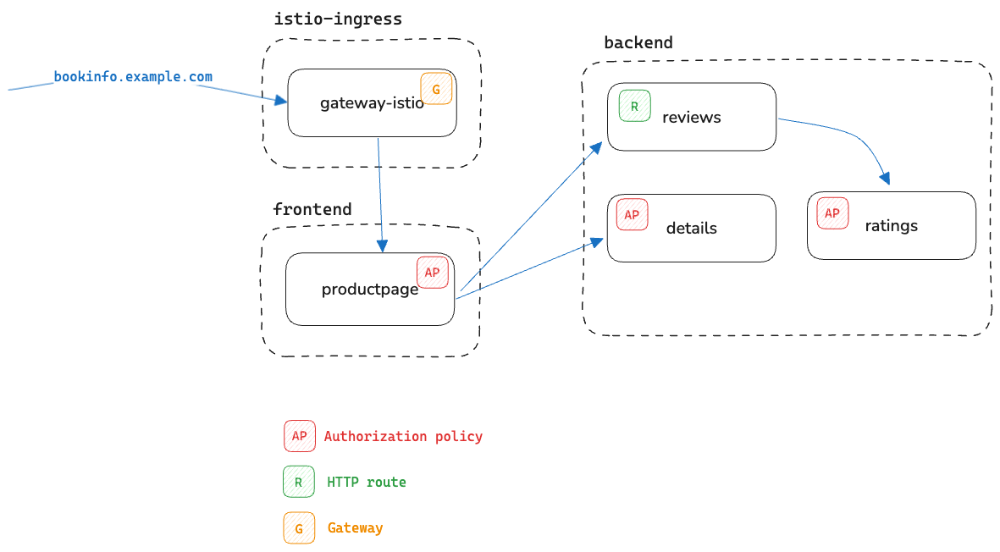

# Migrating from Istio sidecar to Istio ambient

In this migration example, we’ll use the Bookinfo sample application and deploy the services between two namespaces.



We’ll use a [kind cluster](https://kind.sigs.k8s.io/) for this test and install the latest version of [Istio](https://istio.io) using Helm.

## Setup

1. Install Istio:

```bash
helm repo add istio https://istio-release.storage.googleapis.com/charts
helm repo update

kubectl create ns istio-system

helm install istio-base istio/base -n istio-system --set defaultRevision=default --wait
helm install istio-cni istio/cni -n istio-system --wait
helm install istiod istio/istiod -n istio-system --wait
```

2. Enable access logging:

```bash
kubectl apply -f - <<EOF
apiVersion: telemetry.istio.io/v1
kind: Telemetry
metadata:
  name: mesh-default
  namespace: istio-system
spec:
  accessLogging:
    - providers:
      - name: envoy
EOF
```

3. Install Kubernetes Gateway API:

```bash
kubectl get crd gateways.gateway.networking.k8s.io &> /dev/null || \
  { kubectl apply -f https://github.com/kubernetes-sigs/gateway-api/releases/download/v1.1.0/standard-install.yaml }
```

4. Install ingress gateway:

```bash
kubectl create ns istio-ingress

kubectl apply -f - <<EOF
apiVersion: gateway.networking.k8s.io/v1
kind: Gateway
metadata:
  name: gateway
  namespace: istio-ingress
spec:
  gatewayClassName: istio
  listeners:
  - name: http
    hostname: "bookinfo.example.com"
    port: 80
    protocol: HTTP
    allowedRoutes:
      namespaces:
        from: Selector
        selector:
            matchLabels:
              kubernetes.io/metadata.name: frontend
EOF
```

You can check the pod and LB service was created in `istio-ingress` by running `kubectl get svc,po -n istio-ingress`.


4. Install bookinfo application:

```bash
kubectl create ns frontend
kubectl label namespace frontend istio-injection=enabled
kubectl apply -f bookinfo/frontend.yaml -n frontend

kubectl create ns backend
kubectl label namespace backend istio-injection=enabled
kubectl apply -f bookinfo/backend.yaml -n backend
```

5. Create a routing rule to route traffic from the ingress gateway to the `productpage` service:

```bash
kubectl apply -f - <<EOF
apiVersion: gateway.networking.k8s.io/v1
kind: HTTPRoute
metadata:
  name: productpage
  namespace: frontend
spec:
  parentRefs:
  - name: gateway
    namespace: istio-ingress
  hostnames: ["bookinfo.example.com"]
  rules:
  - matches:
    - path:
        type: Exact
        value: /productpage
    - path:
        type: PathPrefix
        value: /static
    - path:
        type: Exact
        value: /login
    - path:
        type: Exact
        value: /logout
    - path:
        type: PathPrefix
        value: /api/v1/products
    backendRefs:
    - name: productpage
      port: 9080
EOF
```

6. Make sure you can access the product page via `http://bookinfo.example.com/productpage` (or LB IP + Host header).

```shell
curl -s -o /dev/null -w "%{http_code}\n" -H "Host: bookinfo.example.com" 172.18.255.200/productpage
```

```console
200
```

## Authorization policies

We'll deploy a couple of authorization policies. First, an authorization policy that's enforced on the product page service and only allows requests to be sent from the ingress gateway:

```bash
kubectl apply -f - <<EOF
apiVersion: security.istio.io/v1
kind: AuthorizationPolicy
metadata:
  name: productpage-viewer
  namespace: frontend
spec:
  selector:
    matchLabels:
      app: productpage
  action: ALLOW
  rules:
  - from:
    - source:
        principals:
        - cluster.local/ns/istio-ingress/sa/gateway-istio
EOF
```

Sending the same request as before (through the ingress gateway) should still work, however, if we deploy a sleep pod in the `frontend` namespace and try to access the product page, it should fail:

```bash
kubectl run -n frontend sleep --image=curlimages/curl --command -- /bin/sleep infinity
kubectl exec -n frontend -it sleep -- curl -s -o /dev/null -w "%{http_code}\n" -H "Host: bookinfo.example.com" productpage:9080/productpage
```

```console
403
```

The second authorization policy will be applied on the `ratings` service. We'll only allow GET and POST requests to be sent from the `reviews-v3` service:

```bash
kubectl apply -f - <<EOF
apiVersion: security.istio.io/v1
kind: AuthorizationPolicy
metadata:
  name: ratings-policy
  namespace: backend
spec:
  selector:
    matchLabels:
      app: ratings
  action: ALLOW
  rules:
  - from:
    - source:
        principals:
        - cluster.local/ns/backend/sa/bookinfo-reviews
    to:
    - operation:
        methods: ["GET", "POST"]
EOF
```

We can test this by deploying a sleep pod in the `backend` namespace and trying to access the ratings service:

```bash
kubectl run -n backend sleep --image=curlimages/curl --command -- /bin/sleep infinity
kubectl exec -n backend -it sleep -- curl -s -o /dev/null -w "%{http_code}\n" ratings.backend:9080/ratings/1
```

```console
403
```

This second policy shouldn't affect the product page, as it's only applied to the ratings service.

The last authorization policy we'll deploy is for the details service and it will only allow GET requests from the product page service:

```bash
kubectl apply -f - <<EOF
apiVersion: security.istio.io/v1
kind: AuthorizationPolicy
metadata:
  name: details-policy
  namespace: backend
spec:
  selector:
    matchLabels:
      app: details
  action: ALLOW
  rules:
  - from:
    - source:
        principals:
        - cluster.local/ns/frontend/sa/bookinfo-productpage
    to:
    - operation:
        methods: ["GET"]
EOF
```

We can test this policy is applied by sending a request from a non-product page service:

```bash
kubectl exec -n backend -it sleep -- curl -s -o /dev/null -w "%{http_code}\n" details.backend:9080/details/1
```

```console
403
```

## Traffic policies

Let's also configure a traffic routing policy that will route all traffic to the `reviews-v3` service:

```bash
kubectl apply -f - <<EOF
apiVersion: gateway.networking.k8s.io/v1
kind: HTTPRoute
metadata:
  name: reviews
  namespace: backend
spec:
  parentRefs:
  - group: ""
    kind: Service
    name: reviews
    port: 9080
  rules:
  - backendRefs:
    - name: reviews-v3
      port: 9080
EOF
```

Make sure you can access the product page via `http://bookinfo.example.com/productpage` (or LB IP + Host header) and notice the reviews are only served by the `reviews-v3` service:

```bash
export GATEWAY_IP=$(kubectl get svc -n istio-ingress gateway-istio -o jsonpath='{.status.loadBalancer.ingress[0].ip}')
curl -s -H "Host: bookinfo.example.com" $GATEWAY_IP/productpage | grep "reviews-"
```

```console
reviews-v3-6f5b775685-sxv4d
reviews-v3-6f5b775685-sxv4d
```

Let's also scale up all deployments to 2 replicas:

```bash
kubectl scale deploy -n frontend --replicas=2 --all
kubectl scale deploy -n backend --replicas=2 --all
```

## Installing Istio ambient mesh

The first step is to upgrade Istio charts with ambient mode enabled and install ztunnel:

```bash
helm install istio-cni istio/cni -n istio-system --set profile=ambient --wait

# Upgrade (reinstall istiod) with ambient profile
helm upgrade istiod istio/istiod --namespace istio-system --set profile=ambient --wait

# Install ztunnel
helm install ztunnel istio/ztunnel -n istio-system --wait
```

Make sure everything is installed:

```bash
helm ls -n istio-system
```

```console
NAME            NAMESPACE       REVISION        UPDATED                                 STATUS          CHART           APP VERSION
istio-base      istio-system    1               2024-10-03 16:10:25.118083 -0700 PDT    deployed        base-1.23.2     1.23.2
istio-cni       istio-system    2               2024-10-03 15:47:31.63797 -0700 PDT     deployed        cni-1.23.2      1.23.2
istiod          istio-system    2               2024-10-03 16:12:31.274487 -0700 PDT    deployed        istiod-1.23.2   1.23.2
ztunnel         istio-system    1               2024-10-03 16:14:06.883523 -0700 PDT    deployed        ztunnel-1.23.2  1.23.2
```

## Migration process

Let's remove the sidecar injection label from the `frontend` and `backend` namespace - this is to ensure that any new pods that are created or restarted won't have the sidecar proxy injected:

```bash
kubectl label namespace frontend istio-injection-
kubectl label namespace backend istio-injection-
```

And we need to label the namespaces to tell Istio we want to add the pods to the ambient mode, once we restart them:

```bash
kubectl label namespace frontend istio.io/dataplane-mode=ambient
kubectl label namespace backend istio.io/dataplane-mode=ambient
```

In the sidecar mode any routing or authorization policies are applied at the client side, so we need to determine whether we need waypoint proxies that will enforce the policies once we remove the sidecar proxies.

1. `productpage-viewer` authorization policy: this policy is applied on the product page service and only allows requests to be sent from the ingress gateway. In this case, because we're not using any L7 concepts, even if we remove the sidecar proxy from the productpage, the ztunnel will automatically enforce the policy.

2. `details-policy` authorization policy: this policy is applied on the details service and allows only productpage service to send GET requests. Because we're using an L7 concept (the GET method), ztunnel won't be able to enforce this policy (it will automatically deny it), so we'll need a waypoint proxy to handle this as well.

3. `ratings-policy` authorization policy: applied on the ratings service and only allows requests from the reviews service with GET or POST methods. Since we're using HTTP method, we'll need a waypoint proxy to enforce this policy.

4. `productpage` HTTP route: this HTTP route configures the ingress gateway to route the traffic to the specific paths on the productpage. Since the routing rules are applied and enforce on the ingress gateway, we don't need to deploy a waypoint proxy for this.

5. `reviews` HTTP route: the route on the reviews service that routes all traffic to the reviews-v3 service. In this case productpage is the client, so if we remove the sidecar proxy the client will not be able to enforce the route. We need to deploy a waypoint proxy for the reviews service to handle the traffic routing.

It's clear that we'll need a waypoint proxy, so let's deploy one in the `backend` namespace and enroll the backend namespace (this means that all pods in the backend namespace will use this instance of the waypoint if needed). Later, you can decide to deploy more waypoint proxies in the backend namespace if needed.

```bash
istioctl waypoint apply -n backend --enroll-namespace --wait
```

```console
waypoint backend/waypoint applied
namespace backend labeled with "istio.io/use-waypoint: waypoint"
```

You can check the waypoint is ready by running:

```bash
kubectl get gtw -n backend
```

```console
NAME       CLASS            ADDRESS        PROGRAMMED   AGE
waypoint   istio-waypoint   10.96.54.173   True         25s
```

Now that we have the waypoint deploy, we can take the existing L7 policies and create an ambient version of them that uses the `targetRef` field. In ambient, the `targetRef` field is the one supported by the waypoints and it tells the waypoint to enforce the policy. We don't want to directly modify the existing policies, because we want to keep them enforced until we restart the workloads and remove the sidecar proxies. If we'd update the existing policies, the sidecar proxies wouldn't know how to enforce them until we restarted the workloads.

The routing policies will be automatically enforced by the waypoint proxies, because we're already using the HTTPRoute resources. If you weren't using that and you were using VirtualServices, you'd have to create an HTTPRoute resource for each VirtualService that you have before you remove the sidecar proxies.

Let's deploy the waypoint version of existing policies:

```bash
kubectl apply -f - <<EOF
apiVersion: security.istio.io/v1
kind: AuthorizationPolicy
metadata:
  name: details-policy-waypoint
  namespace: backend
spec:
  targetRefs:
  - kind: Service
    group: ""
    name: details
  action: ALLOW
  rules:
  - from:
    - source:
        principals:
        - cluster.local/ns/frontend/sa/bookinfo-productpage
    to:
    - operation:
        methods: ["GET"]
---
apiVersion: security.istio.io/v1
kind: AuthorizationPolicy
metadata:
  name: ratings-policy-waypoint
  namespace: backend
spec:
  targetRefs:
  - kind: Service
    group: ""
    name: ratings
  action: ALLOW
  rules:
  - from:
    - source:
        principals:
        - cluster.local/ns/backend/sa/bookinfo-reviews
    to:
    - operation:
        methods: ["GET", "POST"]
EOF
```

We're at the point now where we have the waypoint proxy deployed and the policies are in place. The next step is to restart the pods in the `frontend` and `backend` namespace to remove the sidecar proxies and enroll them in the ambient mode:

```bash
kubectl rollout restart deploy -n frontend
kubectl rollout restart deploy -n backend

kubectl delete po sleep -n frontend
kubectl delete po sleep -n backend

kubectl run -n frontend sleep --image=curlimages/curl --command -- /bin/sleep infinity
kubectl run -n backend sleep --image=curlimages/curl --command -- /bin/sleep infinity
```

We can now run the `istioctl zc workload` and `istioctl zc service` command to verify that all pods were moved to ambient and that the pods in the backend namespace are using the waypoint proxy:

```bash
istioctl zc workload
```

```console
NAMESPACE          POD NAME                              IP          NODE               WAYPOINT PROTOCOL
backend            details-v1-558d6b8747-fd6nx           10.244.0.44 kind-control-plane None     HBONE
backend            details-v1-558d6b8747-tjjwc           10.244.0.39 kind-control-plane None     HBONE
backend            ratings-v1-78d7884947-br5hw           10.244.0.38 kind-control-plane None     HBONE
backend            ratings-v1-78d7884947-mg2p6           10.244.0.46 kind-control-plane None     HBONE
backend            reviews-v1-cdd45ff95-h7nx9            10.244.0.45 kind-control-plane None     HBONE
backend            reviews-v1-cdd45ff95-lxhkb            10.244.0.40 kind-control-plane None     HBONE
backend            reviews-v2-78978699df-9454z           10.244.0.48 kind-control-plane None     HBONE
backend            reviews-v2-78978699df-lv99d           10.244.0.41 kind-control-plane None     HBONE
backend            reviews-v3-79ff749955-c597d           10.244.0.42 kind-control-plane None     HBONE
backend            reviews-v3-79ff749955-fm5lf           10.244.0.47 kind-control-plane None     HBONE
backend            sleep                                 10.244.0.16 kind-control-plane None     TCP
backend            waypoint-69bbfbdfcb-9qqfg             10.244.0.43 kind-control-plane None     TCP
default            kubernetes                            172.18.0.2                     None     TCP
frontend           productpage-v1-55586884d5-kz8tn       10.244.0.36 kind-control-plane None     HBONE
frontend           productpage-v1-55586884d5-mjntp       10.244.0.37 kind-control-plane None     HBONE
frontend           sleep                                 10.244.0.15 kind-control-plane None     TCP
```

```bash
istioctl zc service
```

```console
NAMESPACE      SERVICE NAME            SERVICE VIP   WAYPOINT ENDPOINTS
backend        details                 10.96.152.221 waypoint 2/2
backend        details-v1              10.96.175.236 waypoint 2/2
backend        ratings                 10.96.18.227  waypoint 2/2
backend        ratings-v1              10.96.171.69  waypoint 2/2
backend        reviews                 10.96.152.102 waypoint 6/6
backend        reviews-v1              10.96.94.80   waypoint 2/2
backend        reviews-v2              10.96.15.16   waypoint 2/2
backend        reviews-v3              10.96.119.175 waypoint 2/2
backend        waypoint                10.96.54.173  None     1/1
default        kubernetes              10.96.0.1     None     1/1
frontend       productpage             10.96.239.190 None     2/2
istio-ingress  gateway-istio           10.96.186.15  None     1/1
istio-system   istiod                  10.96.240.238 None     1/1
kube-system    kube-dns                10.96.0.10    None     2/2
metallb-system metallb-webhook-service 10.96.5.191   None     1/1
```

Similarly, if you run `istioctl zc cert`, you'll see that ztunnel issued a certificates for all workloads in the ambient mesh:

```console
CERTIFICATE NAME                                               TYPE     STATUS        VALID CERT     SERIAL NUMBER                        NOT AFTER                NOT BEFORE
spiffe://cluster.local/ns/backend/sa/bookinfo-details          Leaf     Available     true           3a4ddbbaac79c9d8c62fc338ad608311     2024-10-10T23:23:29Z     2024-10-09T23:21:29Z
spiffe://cluster.local/ns/backend/sa/bookinfo-details          Root     Available     true           52e56cc8b52f41ff75649f759d702741     2034-10-07T22:48:53Z     2024-10-09T22:48:53Z
spiffe://cluster.local/ns/backend/sa/bookinfo-ratings          Leaf     Available     true           dddf6a026d8349ea12bce024b6a1de08     2024-10-10T23:23:29Z     2024-10-09T23:21:29Z
spiffe://cluster.local/ns/backend/sa/bookinfo-ratings          Root     Available     true           52e56cc8b52f41ff75649f759d702741     2034-10-07T22:48:53Z     2024-10-09T22:48:53Z
spiffe://cluster.local/ns/backend/sa/bookinfo-reviews          Leaf     Available     true           d65c6c34dbbf48ea9b6265b8ffd3f07c     2024-10-10T23:23:29Z     2024-10-09T23:21:29Z
spiffe://cluster.local/ns/backend/sa/bookinfo-reviews          Root     Available     true           52e56cc8b52f41ff75649f759d702741     2034-10-07T22:48:53Z     2024-10-09T22:48:53Z
spiffe://cluster.local/ns/frontend/sa/bookinfo-productpage     Leaf     Available     true           507dcf851d9c3624915e11c4a96aad32     2024-10-10T22:54:58Z     2024-10-09T22:52:58Z
spiffe://cluster.local/ns/frontend/sa/bookinfo-productpage     Root     Available     true           52e56cc8b52f41ff75649f759d702741     2034-10-07T22:48:53Z     2024-10-09T22:48:53Z
(base)
```

## Testing

The last step is to validate all policies and routes are enforced correctly. We can start by testing the `productpage-viewer` policy:

```bash
kubectl exec -n frontend -it sleep -- curl -s -o /dev/null -w "%{http_code}\n" -H "Host: bookinfo.example.com" productpage:9080/productpage
```

```console
000
command terminated with exit code 56

From ztunnel:
...
2024-10-14T20:14:49.578208Z     error   access  connection complete     src.addr=10.244.0.42:55494 src.workload="sleep" src.namespace="frontend" src.identity="spiffe://cluster.local/ns/frontend/sa/default" dst.addr=10.244.0.36:15008 dst.hbone_addr=10.244.0.36:9080 dst.service="productpage.frontend.svc.cluster.local" dst.workload="productpage-v1-6c65c9f656-wl9c8" dst.namespace="frontend" dst.identity="spiffe://cluster.local/ns/frontend/sa/bookinfo-productpage" direction="outbound" bytes_sent=0 bytes_recv=0 duration="0ms" error="http status: 401 Unauthorized"
...
```

The policy was enforced correctly and the request was denied. We can also test the `details-policy` policy:

```bash
kubectl exec -n frontend -it sleep -- curl -s -o /dev/null -w "%{http_code}\n" -H "Host: bookinfo.example.com" details.backend:9080/details/1
```

```console
403

From waypoint proxy:

[2024-10-14T20:15:48.344Z] "GET /details/1 HTTP/1.1" 403 - rbac_access_denied_matched_policy[none] - "-" 0 19 0 - "-" "curl/8.10.1" "83c73503-607e-4590-9de6-d8c243970763" "bookinfo.example.com" "-" inbound-vip|9080|http|details.backend.svc.cluster.local - 10.96.104.243:9080 10.244.0.42:48646 - default
```

The request was denied as expected. We can also test the `ratings-policy` policy:

```bash
kubectl exec -n backend -it sleep -- curl -s -o /dev/null -w "%{http_code}\n" -H "Host: bookinfo.example.com" ratings.backend:9080/ratings/1
```

```console
403

From waypoint:
[2024-10-14T20:16:26.191Z] "GET /ratings/1 HTTP/1.1" 403 - rbac_access_denied_matched_policy[none] - "-" 0 19 0 - "-" "curl/8.10.1" "f974c98a-ce24-4d36-8619-800df3890f04" "bookinfo.example.com" "-" inbound-vip|9080|http|ratings.backend.svc.cluster.local - 10.96.165.224:9080 10.244.0.41:49922 - default
```


Once we verified all policies are enforced correctly, we can safely remove the authorization policies that were enforced by the sidecar proxies:

```bash
kubectl delete authorizationpolicy -n backend details-policy
kubectl delete authorizationpolicy -n backend ratings-policy
```
